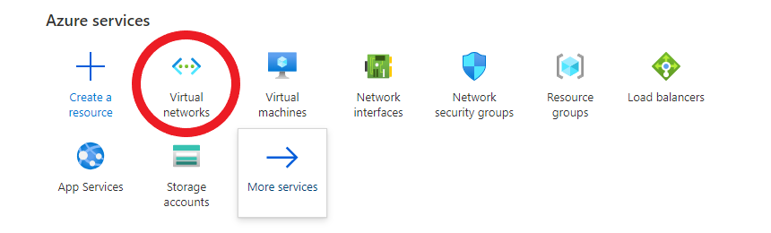
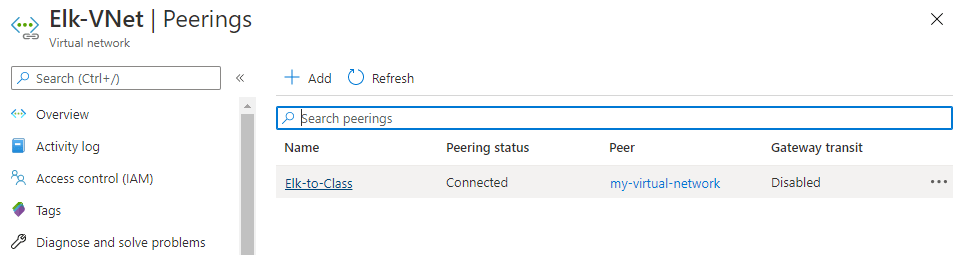

# **Part 1: ELK Installation**
## Step 1: Create a New vNet
- Navigate to [Your Azure Portal](https://www.portal.azure.com)
-  Select "Virtual networks" from the Azure services carousel

    - Make sure the new vNet is in the same resource group as your other vNet.
    - Leave the settings at default.
- Create a Peer connection between your vNets
    - Navigate to the settings portion of either vNet and select "Peerings."
    - Click the Add button, select the vNet to peer, and fill out peering names.
        - Note that these names should reflect vNet flow (i.e. vnet1-to-vnet2).
    - Once you select okay, your Peerings page should look similar to this:
    
## Step 2: Creating a New VM
- Our ELK server VM will need 4GB of RAM to run properly.
- The VM needs a public IP address.
- The VM must be deployed in the same region as your new vNet
- Ensure the VM uses the same SSH keys as your WebVM's.
    - Use cat ~/.ssh/id_rsa.pub to retrieve public ssh key and paste it within azure.

## Step 3: Downloading and Configuring the Container
### Launch the ansible container, and add the new VM to Ansible's hosts file.
     cd /etc/anisble <- navigate to the ansible directory
     
     
     nano hosts      <- edit the host file
     
    
    Example hosts file:
    
    [webservers]
    10.0.0.4
    ansible_python_interpreter=/usr/bin/python3

    10.0.0.5
    ansible_python_interpreter=/usr/bin/python3
    
    10.0.0.6
    ansible_python_interpreter=/usr/bin/python3
    
    Now we want to add a new host group: elk
    
    [elk]
    10.1.0.4         <- Note that your Elk server VM IP may differ.
    ansible_python_interpreter=/usr/bin/python3

### Create a Playbook that Installs Docker and Configures the Container
#### View the install-docker playbook by clicking [here.](.\ELK-Stack-Project\Part-1\Ansible\Playbooks\install-docker.yml)

    sudo nano install-docker.yml    <- Create docker installation playbook
    
    ---
    - hosts: elk
      remote_user: AzureUser  <- Note that your Elk server username may differ.
      become: true
      
      tasks:
        - name: Install aptitude using apt
          apt: name=aptitude state=latest update_cache=yes force_apt_get=yes
        
        - name: Install required system packages
          apt: name={{ item }} state=latest update_cache=yes
          loop: [ 'apt-transport-https', 'ca-certificates', 'curl', 'software-properties-common', 'python3-pip', 'virtualenv', 'python3-setuptools']
          
    - name: Add Docker GPG apt Key
      apt_key:
        url: https://download.docker.com/linux/ubuntu/gpg
        state: present

    - name: Add Docker Repository
      apt_repository:
        repo: deb https://download.docker.com/linux/ubuntu bionic stable
        state: present

    - name: Update apt and install docker-ce
      apt: update_cache=yes name=docker-ce state=latest

    - name: Install Docker Module for Python
      pip:
        name: docker

    - name: Pull default Docker image
      docker_image:
        name: hello-world
        image: hello-world
        source: pull
    

### Launching and Exposing the Container
- Run `ansible-playbook install-ansible.yml` and the new VM should now have Docker installed!

### Create a Playbook that installs and configures ELK
    sudo nano install-elk.yml   <- create a blank playbook.
    
    ---
    - name: Configure ELK VM with Docker
      hosts: elk
      remote_user: AzureUser
      become: true
      tasks:
        # Use apt module
      - name: Install docker.io
        apt:
          force_apt_get: yes
          name: docker.io
          state: present
            
        # Use apt module
      - name: Install python3-pip
        apt:
          force_apt_get: yes
          name: python3-pip
          state: present
          
        # Use pip module
      - name: Install Docker module
        pip:
          name: docker
          state: present
          
        # Use command module
      - name: Increase virtual memory
        command: systctl -w vm.max_map_count=262144
        
        # Use shell module
      - name: Increase virtual memory automatically on VM restart
        shell: echo "vm.max_map_count=262144" >> /etc/sysctl.conf
        
        # Use docker_container module
      - name: Download and launch a docker elk container
        docker_container:
          name: elk
          image: sebp/elk
          state: started
          restart_policy: always
          
        # Please list the ports taht ELK runs on
          published_ports:
            - 5601:5601
            - 9200:9200
            - 5044:5044
            - 9300:9300
            - 9600:9600

   
      