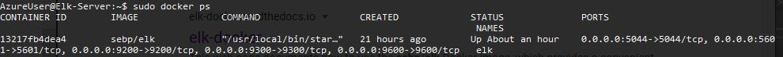

## Automated ELK Stack Deployment

The files in this repository were used to configure the network depicted below.

These files have been tested and used to generate a live ELK deployment on Azure. They can be used to either recreate the entire deployment pictured above. Alternatively, select portions of the ansible file may be used to install only certain pieces of it, such as Filebeat.

  - Click [here](./Ansible/elk-and-filebeat.yml) to view the ansible playbook for both.
  
To run only the elk setup, execute ansible-playbook elk-and-filebeat.yml --tags "elk". Similarly, to run only the filebeat setup, execute ansible-playbook elk-and-filebeat.yml --tags "filebeat"

This document contains the following details:
- Description of the Topology
- Access Policies
- ELK Configuration
  - Beats in Use
  - Machines Being Monitored
- How to Use the Ansible Build

### Description of the Topology

The main purpose of this network is to expose a load-balanced and monitored instance of DVWA, the D*mn Vulnerable Web Application.

Load balancing ensures that the application will be highly monitored, in addition to restricting access to the network.
- Load balancers help to eliminate single points of failure. A jump box is a secure computer that all administrators first connect to before launching any administrative task to ensure security, monitoring, and authenticity of those accessing other machines in an environment.

Integrating an ELK server allows users to easily monitor the vulnerable VMs for changes to the server and system logs.
- Filebeat monitors log files and collects the log events.
- Metricbeat collects metrics from the system and services on the computer.

The configuration details of each machine may be found below.

| Name     | Function | IP Address | Operating System |
|----------|----------|------------|------------------|
| Jump Box | Gateway  | 10.0.0.1   | Linux            |
| Elk-Server     | Logging         | 10.1.0.4           |     Linux             |
| DVWA-VM1     |    Web Application      |     10.0.0.5       |    Linux              |
| DVWA-VM2     |    Web Application      |    10.0.0.6        |         Linux         |

### Access Policies

The machines on the internal network are not exposed to the public Internet. 

Only the JumpBox machine can accept connections from the Internet. Access to this machine is only allowed from the following IP addresses:
- 136.32.218.136

Machines within the network can only be accessed by the Jump Box.
- The Jump Box was able to access the Elk Server. Its IP is 10.0.0.4

A summary of the access policies in place can be found in the table below.

| Name     | Publicly Accessible | Allowed IP Addresses |
|----------|---------------------|----------------------|
| Jump Box | Yes              | 136.32.218.136 (home)    |
| Elk-Server         |   No                  |      10.0.0.4                |
|  DVWA-VM1        |      No               |       10.0.0.4               |
|  DVWA-VM2        |      No               |       10.0.0.4               |

### Elk Configuration

Ansible was used to automate configuration of the ELK machine. No configuration was performed manually, which is advantageous because using automation we can eliminate human error and allow large-scale deployment much quicker.

The playbook implements the following tasks:
- Installing and configuring docker and its prerequisites
- Pulling the image
- Running the image

The following screenshot displays the result of running `docker ps` after successfully configuring the ELK instance.

### Target Machines & Beats
This ELK server is configured to monitor the following machines:
- 10.0.0.5 and 10.0.0.6

We have installed Filebeat on these machines. Filebeat monitors system logs, by default it tracks system, auth/secure logs as well as NGINX activity

### Using the Playbook
In order to use the playbook, you will need to have an Ansible control node already configured. Assuming you have such a control node provisioned: 

SSH into the control node and follow the steps below:
- Copy the filebeat-playbook.yml file to roles.
- Copy the filebeat-config.yml file to files
- Update the filebeat-config.yml file to include:
    - on line 1106 replace the IP address in the hosts line to the IP of your elk machine
      - Keep username and password as is
    - on line 1806 replace the IP address int he host line tot he IP of your elk machine

- Run the playbook, and navigate to http://Elk-Server-IP:5601/app/kibana to check that the installation worked as expected.

- The playbook is filebeat-playbook.yml, you copy that file to roles.
- To install the ELK server on a certain server, see your hosts server, where it should have two machines under webservers and one under elk. Within the respective playbooks specify in the hosts line which category of machine you want to run these playbooks on.
- Which URL do you navigate to in order to check that the ELK server is running?
 http://Elk-Server-IP:5601/app/kibana